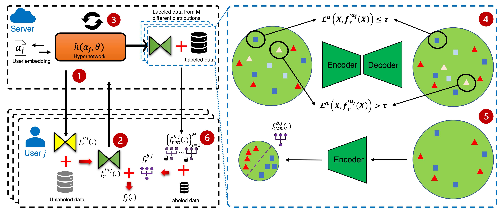

## SemiPFL: Personalized Semi-Supervised Federated Learning Framework for Edge Intelligence
This is an official implementation of ***SemiPFL*** paper. [[Link]](https://arxiv.org/abs/2203.08176)
Published in IEEE Internet of Things Journal, 2023 [[Link]](https://ieeexplore.ieee.org/abstract/document/10012038)



#### Installation
- Create a virtual environment with conda/virtualenv
- Clone the repo
- Run: ```cd <PATH_TO_THE_CLONED_REPO>```
- Run: ```pip install -e .``` to install necessary packages and path links.

---------

#### Reproduce Paper Results
- Upload datasets to ```Datasets```
- Run: ```cd Scripts```
- Run: ```python semipfl.py```
